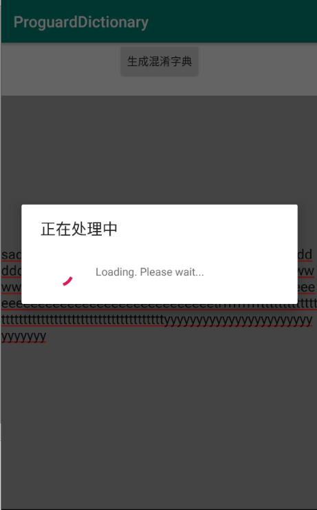
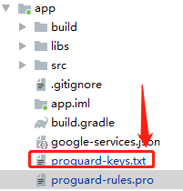

### Android proguard-rules.pro 混淆字典的使用

- 生成混淆字典,生成的字典在手机根目录下



- 将准备好的混淆字典放在Module根目录下



- 配置proguard-rules.pro文件

```properties
#指定外部模糊字典
-obfuscationdictionary ./proguard-keys.txt
#指定class模糊字典
-classobfuscationdictionary ./proguard-keys.txt
#指定package模糊字典
-packageobfuscationdictionary ./proguard-keys.txt
```

